# HSCL Capstone — Multi-Agent Research Orchestrator

A full, end-to-end system for automated web research:
FastAPI backend orchestrating a LangGraph pipeline (plan → search → retrieve → summarize → synthesize → critique → present).
Next.js dashboard for starting runs, live monitoring via SSE, downloading reports, and re-sending results to n8n.
Pluggable search providers (SerpAPI / Tavily / DuckDuckGo).
Async retriever (httpx + Trafilatura + BeautifulSoup fallback).
Prometheus metrics endpoint and JSON logging.

This README shows how to run it locally, what each component does, and how everything fits together—start to finish.

Table of Contents

Project Overview
Architecture
Prerequisites
Setup & Run
Environment variables
Backend (FastAPI)
Dashboard (Next.js)
Health checks
Using the System
Depth presets
Starting a run
Live timeline (SSE)
Downloading reports
Resending to n8n
Data Flow: What Happens in a Run
APIs
Metrics & Observability
n8n Integration
Repository Layout
Development Notes & Tests
Troubleshooting
Extending & Customizing
License
Project Overview

# This project implements a multi-agent research system that, given a topic:

Plans the research steps.
Searches the web (with pluggable providers).
Fetches & cleans relevant pages.
Summarizes findings into bullet notes.
Synthesizes a polished Markdown report with Executive Summary, Key Takeaways, and Citations.
Critiques the structure for quick quality checks.
Saves the report as an artifact and notifies n8n.
A dashboard lets you start runs, watch them live, and download results.

# Architecture

[Dashboard (Next.js)]
│
│ POST /research
▼
[FastAPI Backend]
│
├── SSE stream → /events?run_id={id}
│
└── LangGraph Pipeline:
planner → searcher → retriever → summarizer → synthesizer → critic → presenter
│
▼
Writes report.md artifact
│
▼
Notifies N8N via POST /runs/{run_id}/notify

Artifacts: backend/artifacts/<run_id>/report.md
Metrics:   GET /metrics (Prometheus text)
n8n:       POST /runs/<run_id>/notify  →  N8N_WEBHOOK_URL

# Prerequisites

Python 3.11+
Node 18+ (Next.js)
Accounts/keys as needed:
Groq API key (LLM)
SerpAPI or Tavily API key (for search) — or use DuckDuckGo (no key).
Optional: n8n running locally (default: http://localhost:5678)

Setup & Run
Environment variables

Create backend/.env:

# LLM
GROQ_API_KEY=your_groq_key_here
GROQ_MODEL=llama-3.1-8b-instant

# Search provider: serpapi | tavily | duckduckgo
SEARCH_PROVIDER=serpapi
SERPAPI_API_KEY=your_serpapi_key_here
TAVILY_API_KEY=your_tavily_key_here

# Language preference heuristic for search filtering
PREFER_LANG=en

# n8n webhook (can be disabled / left blank if not used)
N8N_WEBHOOK_URL=http://localhost:5678/webhook/hscl/report

# Backend
PORT=9009
SIM_DELAY_MS=2000

# For dashboard health splash and CORS
NEXT_PUBLIC_BACKEND_URL=http://127.0.0.1:9009

Create dashboard/.env.local:

NEXT_PUBLIC_BACKEND_URL=http://127.0.0.1:9009

Windows note: If you have system proxies, exclude localhost while testing:

$env:NO_PROXY="127.0.0.1,localhost"
$env:HTTP_PROXY=""
$env:HTTPS_PROXY=""

Backend (FastAPI)
cd backend
python -m venv venv
# Windows PowerShell:
.\venv\Scripts\Activate.ps1
# macOS/Linux:
# source venv/bin/activate

pip install -r requirements.txt

# run with auto-reload
python -m uvicorn app.main:app --host 0.0.0.0 --port 9009 --reload

You should see:

Uvicorn running on http://127.0.0.1:9009
Application startup complete.

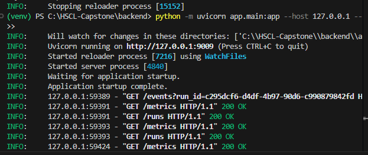

Dashboard (Next.js)
cd dashboard
npm install
npm run dev

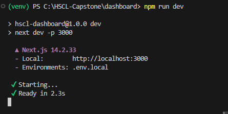

Open: http://localhost:3000/dashboard

Health checks

Backend health: invoke-RestMethod -Uri "http://127.0.0.1:9009/healthz"
Should return JSON:

{
  "status": "ok",
  "service": "hscl-capstone-backend",
  "version": "0.1.0",
  "groq_model": "llama-3.1-8b-instant",
  "search_provider": "serpapi"
}

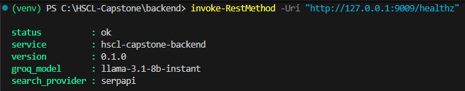

If the dashboard shows “Connecting…”, verify:
Backend is reachable at NEXT_PUBLIC_BACKEND_URL.
Proxies are disabled for localhost.
CORS allows the dashboard origin (the provided config does).

# Using The System
Depth presets

The Depth selector controls sensible defaults:

Depth	Default Max Sources	Typical Report Length
quick	3	Short summary
standard	6	Medium
deep	10	Longer analysis

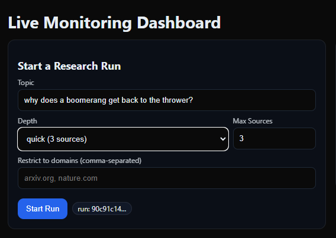

When you change Depth, the dashboard auto-sets Max Sources (unless you’ve manually edited the field, in which case it preserves your choice).
The backend honors max_sources across search, retrieval, and synthesis sizing hints.

# Starting a run

In the dashboard:

Enter a Topic.
Choose a Depth (or set Max Sources manually).
Optionally restrict to domains (comma-separated), e.g. arxiv.org, nature.com.
Click Start Run.

The dashboard immediately:

Stores the returned run_id,
Opens SSE to /events?run_id=...,
Shows each step as it completes.

Live timeline (SSE)

You’ll see steps in order:

Plan      — completed • {"steps":6}
Search    — completed • {"count":5}
Retrieve  — completed • {"docs":5}
Summarize — completed • {"notes":5,"target_words":350}
Synthesize— completed
Critique  — completed • {"notes":1}
Present   — completed • {"path":"...\\artifacts\\<run_id>\\report.md"}
Run       — completed • Run finished

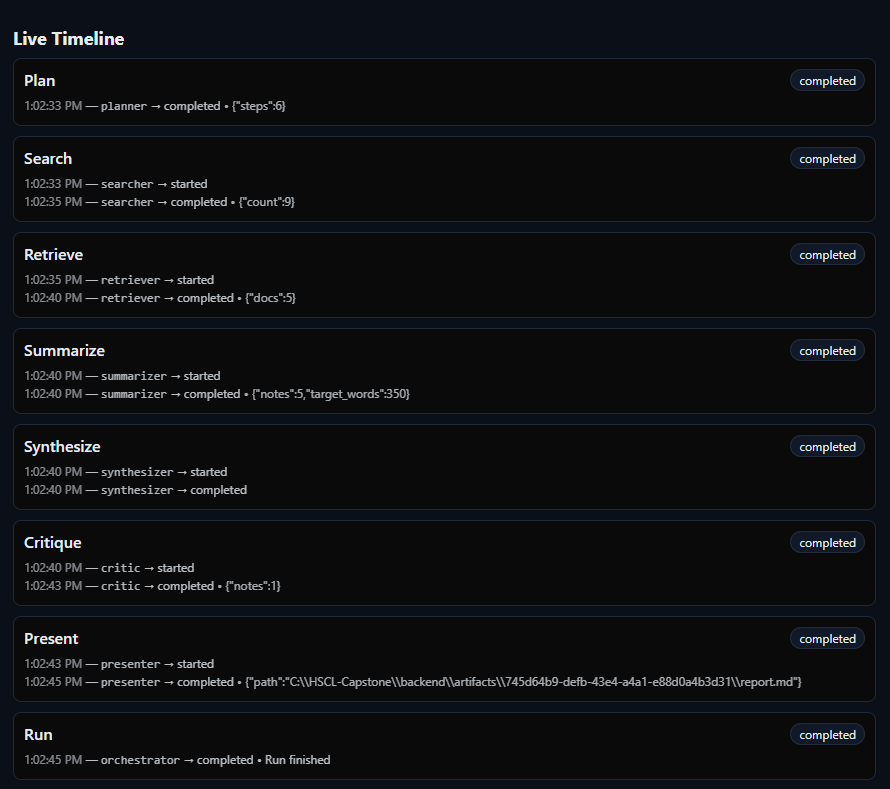

# Downloading reports

Click Download to hit GET /runs/{run_id}/report and open the Markdown artifact in a new tab.

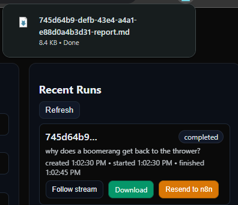

Resending to n8n

Click Resend to n8n to call POST /runs/{run_id}/notify.
The backend re-builds a payload and POSTs to N8N_WEBHOOK_URL.

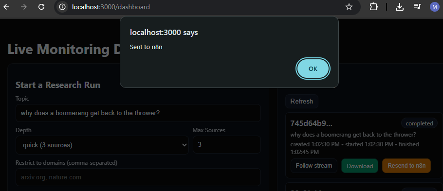
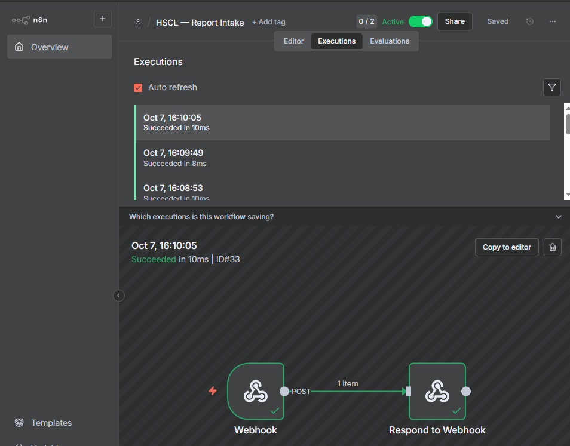

# Data Flow: What Happens in a Run

Plan – Set up a 6-step plan (lightweight).
Search – Use the selected provider (SerpAPI/Tavily/DDG).
Optional domain clamping with site:domain.
De-duplicate by domain and prefer English snippets.
Retrieve – Concurrently download pages with httpx, extract main text with Trafilatura, fallback to BeautifulSoup. Skip very thin pages.
Summarize – Build per-source bullet notes; add report sizing hints.
Synthesize – Ask the LLM to write the final Markdown report with:

# Research Brief: <topic>

**Executive Summary**

## Key Takeaways

## Citations

Critique – Quick structural sanity check.

Present – Save to backend/artifacts/<run_id>/report.md and emit path.

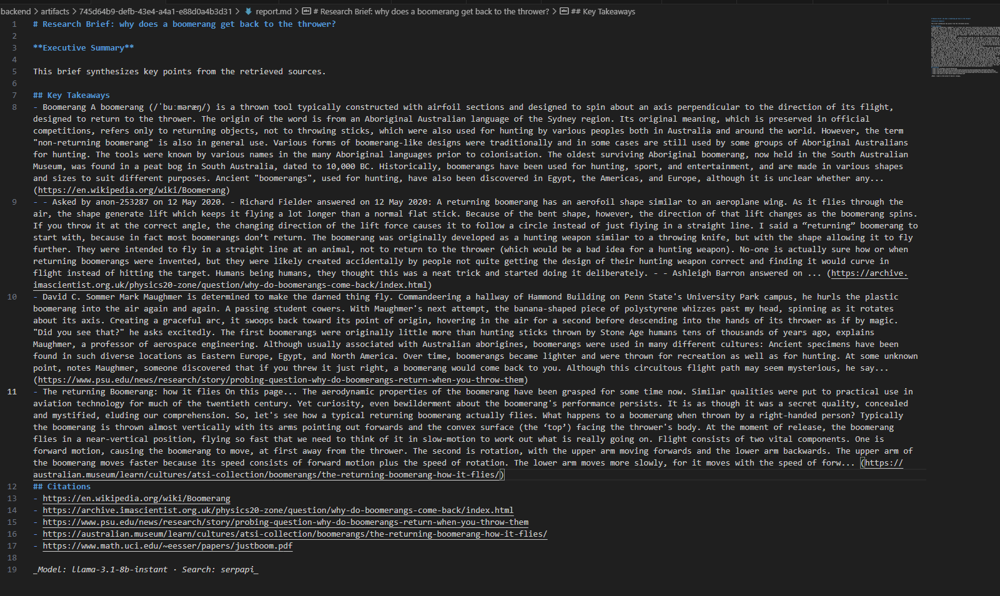

APIs
Invoke-RestMethod -Uri "http://localhost:9009/healthz" -Method GET

Service metadata & configuration snapshot.

POST /research

Start a research run.

Request

{
  "topic": "why does a boomerang get back to the thrower?",
  "depth": "quick",
  "max_sources": 3,
  "domains": ["Restrict to domains (comma-separated)"]
}

Response

{ "run_id": "539f2a05-..." }

Start-Process "http://localhost:9009/events?run_id=<id>

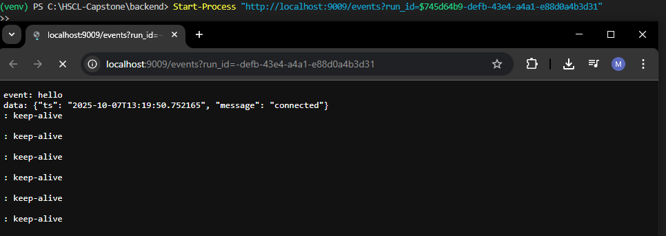

Server-Sent Events stream (content-type: text/event-stream).
Listen for event: run_event entries with JSON payloads:

event: run_event
data: {"event_id":"...","run_id":"...","step":"search","agent":"searcher","status":"completed","ts":"...","data":{"count":5}}

curl http://localhost:9009/runs

List in-memory run records:

[
  {
    "run_id": "ea905faa-...",
    "status": "completed",
    "created_at": "...",
    "started_at": "...",
    "finished_at": "...",
    "topic": "explain polymorphism",
    "depth": "deep"
  }
]

Invoke-RestMethod -Uri "http://localhost:9009/runs/$runId" -Method GET

Get one run record.

Invoke-WebRequest -Uri "http://localhost:9009/runs/$runId/report" -OutFile "report.md"

Serve the saved report.md artifact.

Invoke-RestMethod -Uri "http://localhost:9009/runs/$runId/notify" -Method POST

Re-send payload to n8n webhook. Returns:

{ "ok": true, "result": { "status": 200 } }

Metrics & Observability

GET /metrics exposes Prometheus text format:
http_requests_total{handler,status}
groq_requests_total{agent}
groq_tokens_total{type,agent}
webhook_requests_total{service}
webhook_errors_total{service}

The dashboard polls /metrics every 10s and renders a Metrics Snapshot for quick insight.

Logs are structured as JSON (see observability/logger.py).
SSE events are published from each graph node (see observability/events.py).

n8n Integration

Start n8n locally (default UI on http://localhost:5678).
Create a workflow: Webhook → Respond to Webhook.
Copy the production webhook URL (e.g., http://localhost:5678/webhook/hscl/report).
Set backend .env:
N8N_WEBHOOK_URL=http://localhost:5678/webhook/hscl/report

From the dashboard, click Resend to n8n on a completed run.

You’ll see executions appear in n8n with the payload, including:

run_id
model, search_provider
artifact_path
report_md (full Markdown)
ts, etc.
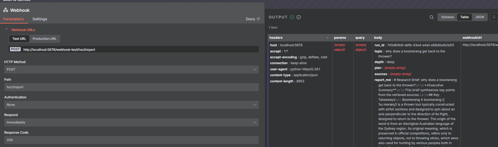
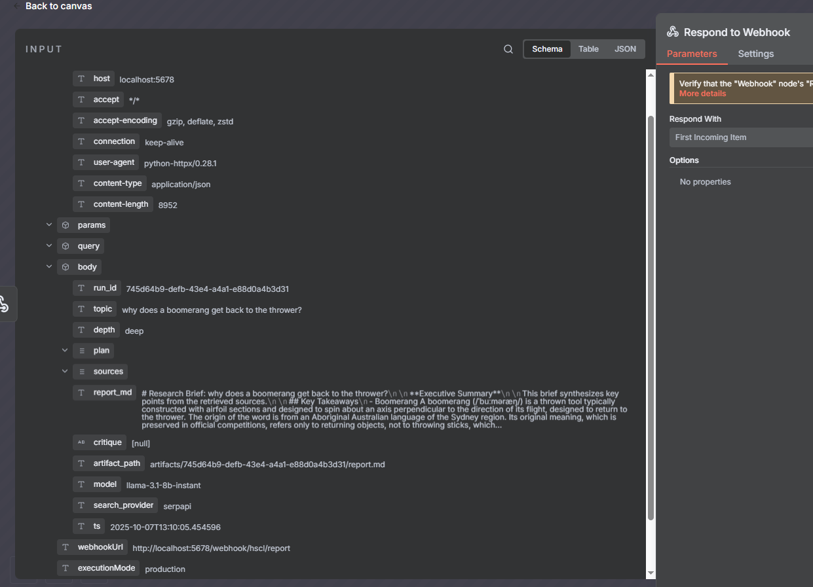

If you see a webhook_errors_total bump or a toast “Notify failed”, ensure n8n is running and N8N_WEBHOOK_URL is correct.

Repository Layout
backend/
  app/
    main.py 
    config.py                    
    graph/
      graph.py                   
      state.py                   
    agents/                      
    tools/
      search_providers/
        serpapi.py               
        tavily.py                
        duckduckgo.py            
        __init__.py              
      fetcher.py                 
    integration/
      n8n.py                     
    observability/
      metrics.py                 
      events.py                  
      logger.py                  
    storage/
      runs.py                    
      files.py                   
  artifacts/<run_id>/report.md   
  tests/test_smoke.py            
  requirements.txt
  .env

dashboard/
  app/dashboard/page.tsx         
  next.config.js
  package.json
  .env.local

Development Notes & Tests
Lint/format (optional)

Use your preferred tools (e.g., ruff, black, eslint, prettier).

Smoke test

From backend/:

# venv active
python tests/test_smoke.py

Expected:

Running smoke tests...
✓ healthz check passed
✓ Created run: <uuid>
✓ Run completed with status: completed
All tests passed

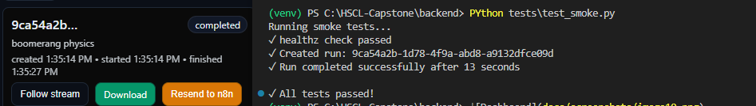

If it fails with KeyError('run_id'), make sure you’re using the path param notify route:
POST /runs/{run_id}/notify (no body required).

Troubleshooting

Dashboard says “Connecting…”
Verify backend is running on http://127.0.0.1:9009.
Check NEXT_PUBLIC_BACKEND_URL in both places.
Disable proxies for localhost (see PowerShell snippet above).
Hit GET /healthz directly—do you get JSON?
No search results / Search errors
Confirm SEARCH_PROVIDER and its API key:
SERPAPI_API_KEY for SerpAPI,
TAVILY_API_KEY for Tavily.
Ensure the provider module exists & is saved in tools/search_providers/.
SSE stream shows no events
Ensure you selected a run and the dashboard opened /events?run_id=....
Check backend logs for step events.
Notify → n8n fails
Is n8n running and the webhook URL correct?
See webhook_errors_total in /metrics and backend logs.
Artifacts missing after run
See presenter step output (SSE will log the path).
Check filesystem permissions or Windows path quoting issues if you modified paths.
Extending & Customizing

Add a search provider
Implement async def search(query: str, max_results: int, domains: Optional[List[str]]) -> List[Dict[str, Any]] under tools/search_providers/your_provider.py and wire it in __init__.py.

Change depth behavior
Adjust DEPTH_DEFAULTS in the dashboard and (optionally) link depth to different target_words or more aggressive retrieval logic in backend nodes.

Improve critique
Expand the critic to check citations, section completeness, or run a quick fact-check loop.

Persist runs
Replace the in-memory run store with SQLite or Postgres to survive restarts.

Export formats
Convert Markdown to PDF/HTML in a new endpoint and add a Download PDF button.

Authentication
Gate the dashboard and/or backend with basic auth or a header token for demos.

License

Choose a license (e.g., MIT/Apache-2.0) and place it in LICENSE.